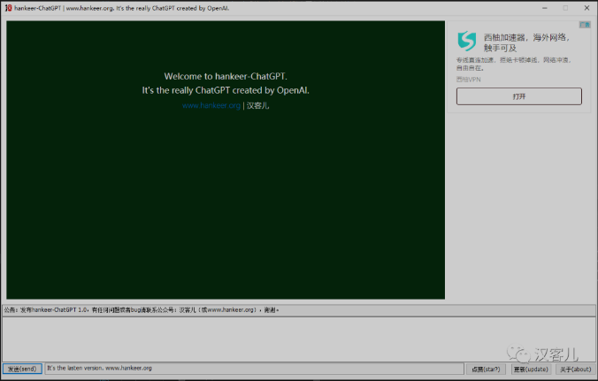

# hankeer-chatgpt

Welcome to hankeer-ChatGPT.   It's the really ChatGPT created by OpenAI.

If you cant use chat.openai.com/chat, You can try hankeer-chatgpt.

Just run it and you can experience the magic ChatGPT.

Because the limit of ChatGPT, you cant ask too many questions in one hour.

You can wait and try again.

欢迎来到hankeer-ChatGPT，这是真正的OpenAI的ChatGPT。

如果你不能注册或者使用官方的ChatGPT，你可以试试hankeer-chatgpt。

你只需要运行软件，就可以马上体验到神奇的ChatGPT。

由于ChatGPT限制，一小时后内不能问太多问题。

等等之后可以继续尝试。

# Your account

If you have the ChatGPT account, you can use your session in hankeer-chatgpt.

The advantage is that it will not be affected by the instability of chatgpt official website. After logging in once, it can be used stably within a month.

如果你已经有ChatGPT账号，hankeer-chatgpt可以支持填入你的账号的session，独立使用。

好处是不需要梯子，登录一次后，一个月之内都可以稳定使用（ChatGPT官网经常出问题，需要重新登录）。

1. After you login [ChatGPT](chat.openai.com/chat)，visit [session page](https://chat.openai.com/api/auth/session), you can get the session data.
2. Run hankeer-chatgpt and set the checkbox button, then typein the session data. pression ok button.
3. If the message is success, you can use hankeer-chatgpt in your self account.

1. 当你登录 [ChatGPT](chat.openai.com/chat)之后，访问 [session page](https://chat.openai.com/api/auth/session)页面，你就可以拿到session数据。
2. 运行hankeer-chargpt，然后选中复选框，输入session数据，确认即可。
3. 如果提示success，你就可以在hankeer-chatgpt中使用自己账号访问ChatGPT了。

# support me 

If you think hankeer-chatgpt can help you, buy me a coffee? Thanks.

如果你觉得软件对你有用，可以支持一下我的工作，谢谢。

